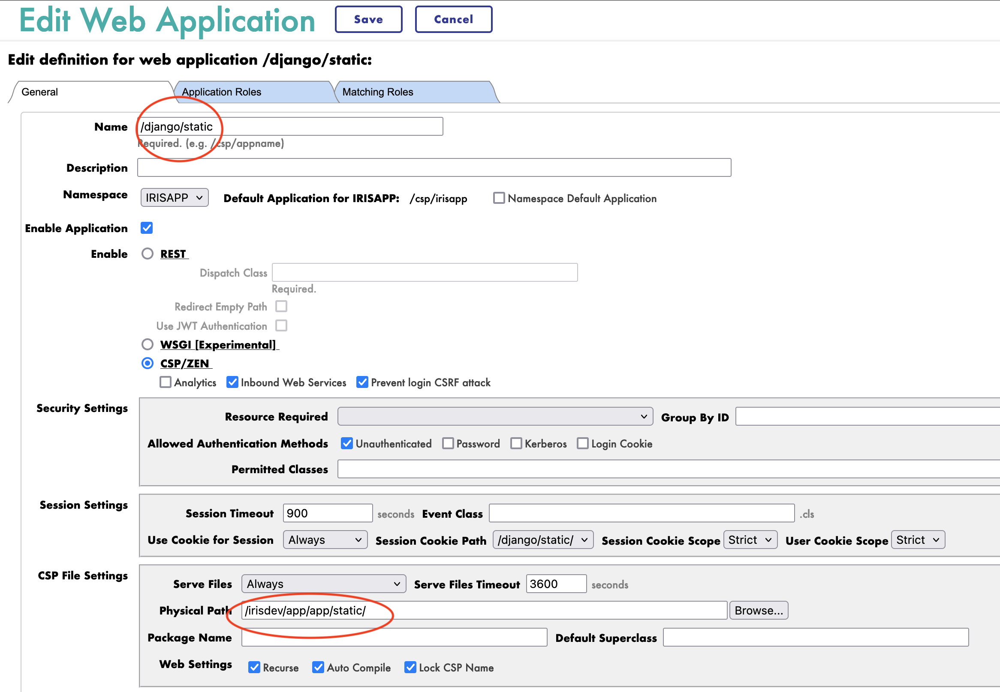

# iris-django-template


## Description

This is a template for an Django application that can be deployed in IRIS as an native Web Application.

## Installation

1. Clone the repository
2. Create a virtual environment
3. Install the requirements
4. Run the docker-compose file

```bash
git clone
cd iris-django-template
python3 -m venv .venv
source .venv/bin/activate
pip install -r requirements.txt
docker-compose up
```

## Usage

The base URL is `http://localhost:53795/django/`.

### Endpoints

- `/iris` - Returns a JSON object with the top 10 classes present in the IRISAPP namespace.
- `/interop` - A ping endpoint to test the interoperability framework of IRIS.
- `/api/patients` - A list endpoint for a Patient object.
- `/api/patients/<pk></pk>` - A retrieve endpoint for a Patient object.
- `/api/genomes/<pk>` - A retrieve endpoint for a Genome object.
- `/api/pharmacogenomics/get-pharmacogenomics-from-genome/` - API for retrieve pharmacogenomics
  from an array of genes

## Code presentation

The Django application is structured as follows:

- `app` - Django project folder
  - `app` - Django app folder for configuration
    - `settings.py` - Django settings file
    - `urls.py` - Django URL configuration file to connect the views to the URLs
    - `wsgi.py` - Django WSGI file
    - `asgi.py` - Django ASGI file
  - `community` - Django app folder for the community app, crud on Post, Comment, Patient, Genome
    and Pharmacogenomics objects
    - `models.py` - Django models file for the Post, Comment, Patient, Genome
    and Pharmacogenomics objects
    - `views.py` - Django views file to access the Post, Comment, Patient, Genome
    and Pharmacogenomics objects
    - `serializers.py` - Django serializers file for the Post, Comment, Patient, Genome
    and Pharmacogenomics objects
    - `admin.py` - Django admin file add crud to the admin interface
    - `migrations` - Django migrations folder to build the database
    - `fixtures` - Django fixtures folder demo data
  - `sqloniris` - Django app folder for the SQL on IRIS app
    - `views.py` - Django views file to query the IRISAPP namespace
    - `apps.py` - Django app configuration file
  - `interop` - Django app folder for the interoperability app
    - `views.py` - Django views file to test the interoperability framework
    - `apps.py` - Django app configuration file
  - `manage.py` - Django management file

## Troubleshooting

### How to run the Django application in a standalone mode

To run the Django application in a standalone mode, we can use the following command:

```bash
cd /irisdev/app/app
python3 manage.py runserver 0.0.0.0:8001
```

This will run the Django application on the default port `8001`.

NB : You must be inside of the container to run this command.

NOTE: This projects starts the Django server by default for easy debug. (You don't have the rebuild
the image when you make changes to the Django code)

```bash
docker exec -it iris-django-template-iris-1 bash
```

### Restart the application in IRIS

Be in `DEBUG` mode make multiple calls to the application, and the changes will be reflected in the application.

### How to access the IRIS Management Portal

You can access the IRIS Management Portal by going to `http://localhost:53795/csp/sys/UtilHome.csp`.

### Run this template locally

For this you need to have IRIS installed on your machine.

Next you need to create a namespace named `IRISAPP`.

Install the requirements.

```bash
# Move to the app directory
cd /irisdev/app/app

# python manage.py flush --no-input
python3 manage.py migrate
# create superuser
export DJANGO_SUPERUSER_PASSWORD=SYS
python3 manage.py createsuperuser --no-input --username SuperUser --email admin@admin.fr

# load demo data
python3 manage.py loaddata community/fixtures/demo.json

# collect static files
python3 manage.py collectstatic --no-input --clear

# init iop
iop --init

# load production
iop -m /irisdev/app/app/interop/settings.py

# start production
iop --start Python.Production
```

### How to serve static files

To serve the static files in the Django application, we can use the following command:

```bash
cd /irisdev/app
python3 manage.py collectstatic
```

This will collect the static files from the Django application and serve them in the `/irisdev/app/static` directory.

To publish the static files in IRIS, configure the `Security->Applications->Web Applications` section.


